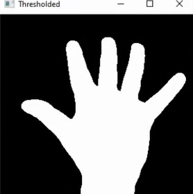
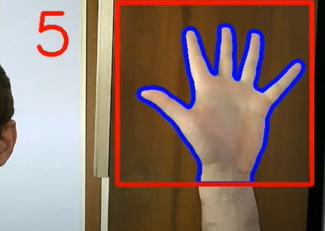

# Hand Detection and Finger Counting using Computer Vision

This project uses OpenCV and basic computer vision techniques to detect a human hand in real-time and count the number of fingers shown using a webcam.

## Project Objective

To develop a system that:
- Captures hand gestures using a webcam.
- Detects and segments the hand region from the background.
- Applies contour and convex hull analysis to identify fingers.
- Counts the number of extended fingers and displays the count live.

---

## Technologies Used

- Python 3
- OpenCV
- NumPy
- scikit-learn (for distance calculations)

---


## Setup Instructions

### 1. Install Dependencies

Make sure you have Python installed. Then run:

```bash
pip install opencv-python numpy scikit-learn
```

### 2. Run the Code

You can run it either as a Python script or in a Jupyter notebook:

```bash
python main.py
```

Or open `main.ipynb` in Jupyter Notebook and run the cells.

---

## How It Works

1. **Background Initialization:**  
   For the first 60 frames, the system builds an average background image.

2. **Hand Segmentation:**  
   The ROI (Region of Interest) is processed to isolate the hand from the background using absolute difference and thresholding.

3. **Convex Hull & Finger Counting:**  
   - The largest contour (hand) is analyzed using convex hull geometry.
   - A circular ROI is drawn around the palm center.
   - Contours inside this circle are analyzed to count fingers, filtering out the wrist.

---

## Live Demo Preview

The live webcam window will show:
- Your hand inside a red rectangle (ROI).
- A blue contour around your hand.
- The number of detected fingers displayed at the top left.
- The thresholded hand segmentation in a separate window.

---

## Controls

- Press `Esc` to exit the program.

---

## Applications

- Gesture-based interfaces
- Sign language recognition (basic)
- Touchless control systems
- Educational projects and demos

---

## Results

### Threshold Image

)

---

### Hand Convex 


---

### Detection and finger count


---


[def]: "hand